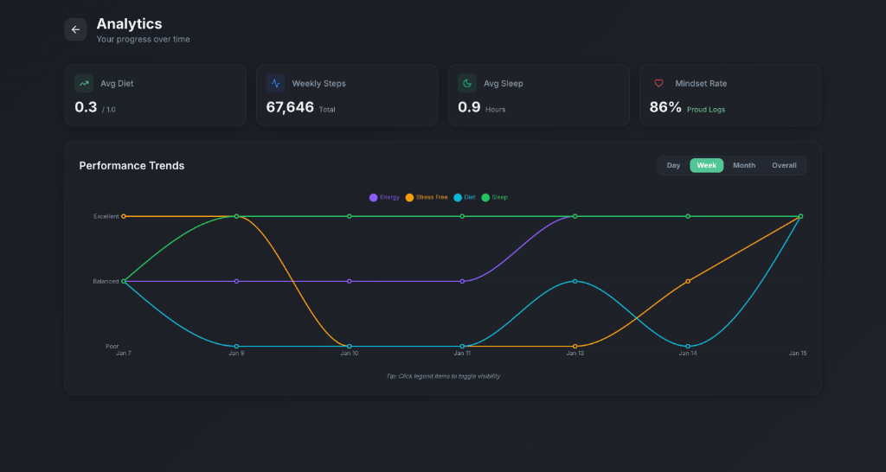
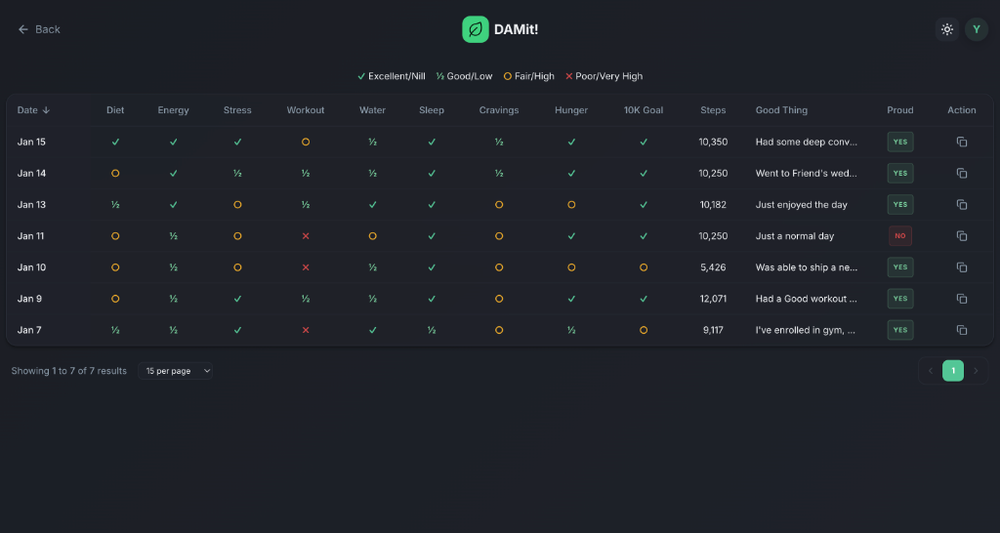
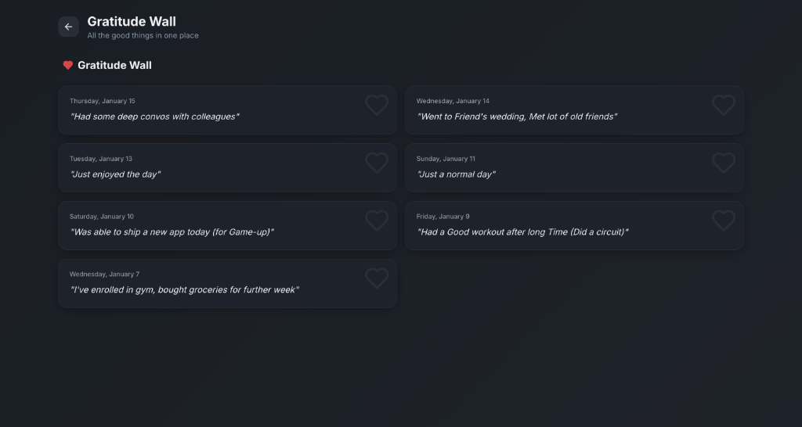

<div align="center">

# 🎯 DAMit! - Daily Accountable Message

### Your Personal Well-being & Habit Tracker

[](https://damit.vercel.app)
[](https://www.typescriptlang.org/)
[](https://reactjs.org/)
[](https://supabase.com/)
[](https://opensource.org/licenses/MIT)

**Track your daily habits, visualize your progress, and celebrate your wins** 🚀

[Live Demo](https://damit.vercel.app) · [Report Bug](https://github.com/YeswanthRajakumarr/damit/issues) · [Request Feature](https://github.com/YeswanthRajakumarr/damit/issues)

</div>

---

## ✨ Features

### 📊 **Comprehensive Analytics Dashboard**
Track your well-being metrics with beautiful, interactive charts and insights.



- **Performance Trends**: Visualize your diet, energy, stress, and sleep patterns over time
- **Smart Statistics**: Average metrics, step counts, and mindset tracking
- **Time Range Filters**: View data by day, week, month, or overall
- **Interactive Charts**: Click legend items to toggle metrics visibility

### 📝 **Detailed Logs Table**
View and manage all your daily entries in one powerful interface.



- **Server-Side Pagination**: Efficiently browse through hundreds of logs
- **Customizable Page Size**: Choose 10, 15, 20, 50, or 100 entries per page
- **Quick Jump Navigation**: Jump to any page instantly
- **One-Click Copy**: Export individual logs to clipboard in formatted text
- **Visual Indicators**: Color-coded symbols for quick status recognition
- **Sortable Columns**: Sort by date in ascending or descending order

### ❤️ **Gratitude Wall**
Celebrate the good things in life with your personal gratitude journal.



- **Daily Gratitude**: Record what you're grateful for each day
- **Beautiful Card Layout**: Elegant display of your positive moments
- **Chronological Timeline**: See your journey of appreciation
- **Heart Reactions**: Like and favorite your favorite entries

### 🎨 **Additional Features**

- ✅ **Daily Check-ins**: Track diet, energy, stress, sleep, workouts, and more
- 🎭 **Animated UI**: Smooth transitions powered by Framer Motion
- 🌓 **Dark/Light Mode**: Fully themable interface with system preference detection
- 📱 **PWA Support**: Install on mobile and desktop for offline access
- 🔐 **Secure Authentication**: User accounts powered by Supabase
- 📈 **Progress Tracking**: Visual completion indicators
- 🎯 **Step Goal Tracking**: Monitor your daily 10K step goal
- 💪 **Workout Logging**: Record and track your fitness activities

---

## 🛠️ Tech Stack

### Frontend
- **Framework**: [React 18](https://react.dev/) + [Vite](https://vitejs.dev/)
- **Language**: [TypeScript](https://www.typescriptlang.org/)
- **Styling**: [Tailwind CSS](https://tailwindcss.com/)
- **UI Components**: [shadcn/ui](https://ui.shadcn.com/) (Radix UI primitives)
- **Animations**: [Framer Motion](https://www.framer.com/motion/)
- **Charts**: [Recharts](https://recharts.org/)
- **Icons**: [Lucide React](https://lucide.dev/)

### State & Data
- **State Management**: [TanStack Query (React Query)](https://tanstack.com/query/latest)
- **Forms**: [React Hook Form](https://react-hook-form.com/)
- **Validation**: [Zod](https://zod.dev/)
- **Date Handling**: [date-fns](https://date-fns.org/)

### Backend & Infrastructure
- **Backend/Auth**: [Supabase](https://supabase.com/)
- **Database**: PostgreSQL (via Supabase)
- **Hosting**: [Vercel](https://vercel.com/)
- **PWA**: [Vite PWA Plugin](https://vite-pwa-org.netlify.app/)

### Developer Experience
- **Testing**: [Vitest](https://vitest.dev/) (Unit) & [Playwright](https://playwright.dev/) (E2E)
- **Linting**: [ESLint](https://eslint.org/)
- **Type Checking**: TypeScript strict mode
- **Code Quality**: Pre-commit hooks with Husky

---

## � Getting Started

### Prerequisites

- **Node.js** (v18 or higher)
- **npm**, **yarn**, or **pnpm**
- **Supabase Account** (free tier available)

### Installation

1. **Clone the repository**
   ```bash
   git clone https://github.com/YeswanthRajakumarr/damit.git
   cd damit
   ```

2. **Install dependencies**
   ```bash
   npm install
   # or
   yarn install
   # or
   pnpm install
   ```

3. **Set up environment variables**
   
   Create a `.env` file in the root directory:
   ```env
   VITE_SUPABASE_URL=your_supabase_project_url
   VITE_SUPABASE_ANON_KEY=your_supabase_anon_key
   ```

4. **Set up Supabase database**
   
   Run the SQL schema in your Supabase project (see `supabase/schema.sql`):
   - Create the `daily_logs` table
   - Create the `profiles` table
   - Set up Row Level Security (RLS) policies

5. **Start the development server**
   ```bash
   npm run dev
   ```

6. **Open your browser**
   
   Navigate to `http://localhost:5173`

---

## 📜 Available Scripts

| Command | Description |
|---------|-------------|
| `npm run dev` | Start development server with hot reload |
| `npm run build` | Build optimized production bundle |
| `npm run preview` | Preview production build locally |
| `npm run lint` | Run ESLint to check code quality |
| `npm run test` | Run unit tests with Vitest |
| `npm run test:e2e` | Run end-to-end tests with Playwright |
| `npm run type-check` | Run TypeScript type checking |

---

## 📁 Project Structure

```
damit/
├── public/              # Static assets
├── src/
│   ├── components/      # React components
│   │   ├── analytics/   # Analytics-specific components
│   │   ├── common/      # Shared components
│   │   ├── logs/        # Logs table components
│   │   └── ui/          # shadcn/ui components
│   ├── data/            # Static data and configurations
│   ├── hooks/           # Custom React hooks
│   ├── integrations/    # Third-party integrations (Supabase)
│   ├── lib/             # Utility functions
│   ├── pages/           # Page components
│   ├── App.tsx          # Main app component
│   └── main.tsx         # App entry point
├── screenshots/         # App screenshots for README
└── supabase/           # Supabase configuration and migrations
```

---

## 🎯 Roadmap

- [x] Daily habit tracking
- [x] Analytics dashboard with trends
- [x] Gratitude wall
- [x] Server-side pagination
- [x] PWA support
- [ ] Export data to CSV/JSON
- [ ] Weekly/Monthly reports
- [ ] Goal setting and reminders
- [ ] Social sharing features
- [ ] Mobile app (React Native)
- [ ] AI-powered insights

---

## 🤝 Contributing

Contributions are what make the open-source community such an amazing place to learn, inspire, and create. Any contributions you make are **greatly appreciated**.

1. Fork the Project
2. Create your Feature Branch (`git checkout -b feature/AmazingFeature`)
3. Commit your Changes (`git commit -m 'Add some AmazingFeature'`)
4. Push to the Branch (`git push origin feature/AmazingFeature`)
5. Open a Pull Request

---

## 📄 License

Distributed under the MIT License. See `LICENSE` for more information.

---

## 👨‍💻 Author

**Yeswanth Rajakumar**

- GitHub: [@YeswanthRajakumarr](https://github.com/YeswanthRajakumarr)
- LinkedIn: [Yeswanth Rajakumar](https://linkedin.com/in/yeswanth-rajakumar)

---

## 🙏 Acknowledgments

- [shadcn/ui](https://ui.shadcn.com/) for the beautiful component library
- [Supabase](https://supabase.com/) for the amazing backend platform
- [Vercel](https://vercel.com/) for seamless deployment
- All the open-source libraries that made this project possible

---

<div align="center">

**If you found this project helpful, please give it a ⭐️!**

Made with ❤️ by [Yeswanth Rajakumar](https://github.com/YeswanthRajakumarr)

</div>
